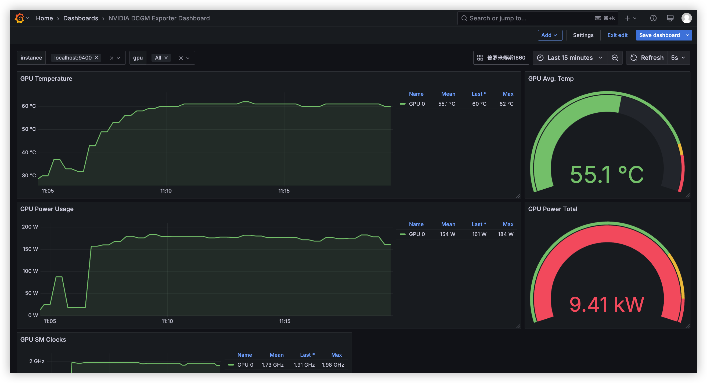
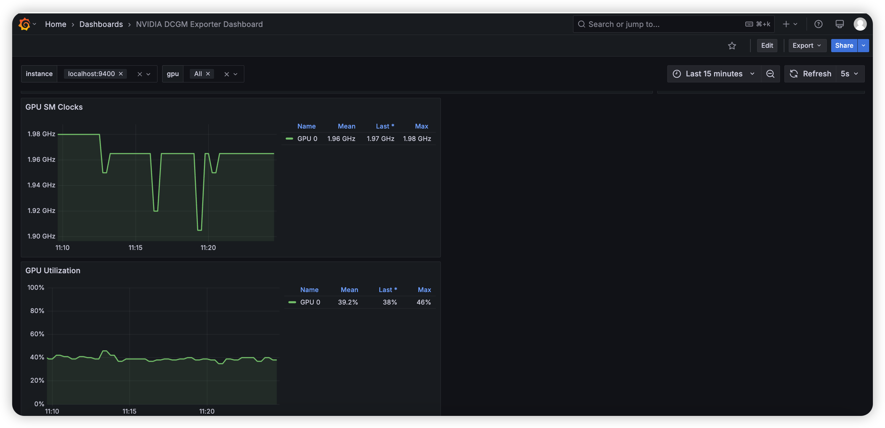
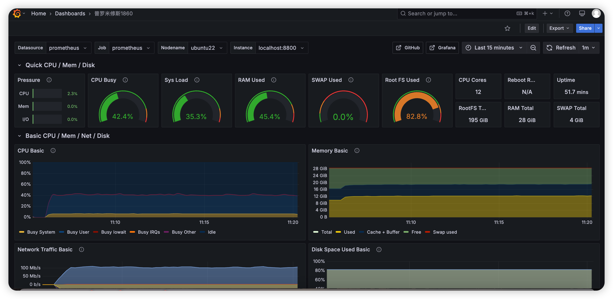
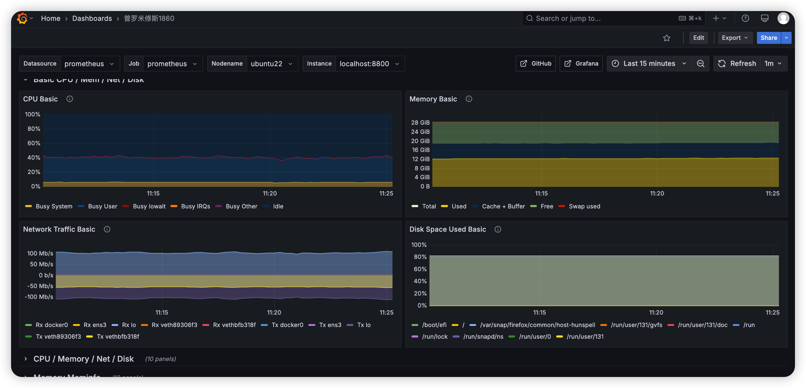

# 服务器监控系统部署与测试指南

本文档旨在提供一份清晰、详细的指南，用于在Linux服务器上部署一套完整的监控系统，涵盖 Node Exporter、Prometheus、Grafana 的安装、配置及基础测试，并包含可选的GPU监控配置以及如何扩展至多服务器环境。

**目录**

- [1. 部署 Node Exporter](#1-部署-node-exporter)
  - [1.1 测试环境快速部署](#11-测试环境快速部署)
  - [1.2 生产环境部署 (推荐)](#12-生产环境部署-推荐)
- [2. 部署 Prometheus](#2-部署-prometheus)
  - [2.1 测试环境快速部署](#21-测试环境快速部署)
  - [2.2 生产环境部署 (推荐)](#22-生产环境部署-推荐)
- [3. 部署 Grafana](#3-部署-grafana)
- [4. 配置 Grafana 数据源与仪表盘](#4-配置-grafana-数据源与仪表盘)
- [5. GPU 资源监控配置 (可选)](#5-gpu-资源监控配置-可选)
  - [5.1 安装部署 DCGM Exporter (使用 Docker)](#51-安装部署-dcgm-exporter-使用-docker)
  - [5.2 验证 DCGM Exporter 运行](#52-验证-dcgm-exporter-运行)
  - [5.3 配置 Prometheus 抓取 DCGM 指标](#53-配置-prometheus-抓取-dcgm-指标)
  - [5.4 在 Grafana 中导入 NVIDIA GPU 仪表盘](#54-在-grafana-中导入-nvidia-gpu-仪表盘)
  - [5.5 GPU 监控效果预览](#55-gpu-监控效果预览)
- [6. 扩展：监控多台服务器与 GPU](#6-扩展监控多台服务器与-gpu)
  - [6.1 核心思路](#61-核心思路)
  - [6.2 详细步骤](#62-详细步骤)
    - [前提条件](#前提条件)
    - [步骤 1：在所有目标服务器上部署 Exporters](#步骤-1在所有目标服务器上部署-exporters)
    - [步骤 2：修改中央 Prometheus 服务器的配置 (`prometheus.yml`)](#步骤-2修改中央-prometheus-服务器的配置-prometheususyml)
    - [步骤 3：在 Grafana 中可视化多服务器数据](#步骤-3在-grafana-中可视化多服务器数据)
  - [6.3 总结与最佳实践](#63-总结与最佳实践)
- [7. 常用服务管理命令 (systemd)](#7-常用服务管理命令-systemd)
- [8. 完整监控效果预览](#8-完整监控效果预览)
- [9. 重要注意事项与后续步骤](#9-重要注意事项与后续步骤)

## 1. 部署 Node Exporter

Node Exporter 负责收集服务器的硬件和操作系统层面的基础指标。

**重要提示：** 文档中使用的软件版本（如 Node Exporter v1.7.0, Prometheus v2.52.0）仅为编写时推荐，部署时请访问官方 GitHub Releases 页面获取最新的 **稳定版本**。

### 1.1 测试环境快速部署

此方法适用于快速测试，不推荐用于生产环境。

```bash
# 访问 https://github.com/prometheus/node_exporter/releases 获取最新稳定版下载链接
# 下载 Node Exporter (示例版本 v1.7.0)
wget https://github.com/prometheus/node_exporter/releases/download/v1.7.0/node_exporter-1.7.0.linux-amd64.tar.gz

# 解压
tar -xzf node_exporter-1.7.0.linux-amd64.tar.gz
cd node_exporter-1.7.0.linux-amd64

# 启动 Node Exporter (后台运行，监听 9200 端口)
# 注意：'&' 使其在后台运行，关闭终端可能导致进程退出
./node_exporter --web.listen-address=":9200" &
```

### 1.2 生产环境部署 (推荐)

使用 `systemd` 管理服务，确保稳定运行和开机自启。

```bash
# 访问 https://github.com/prometheus/node_exporter/releases 获取最新稳定版下载链接
# 下载 Node Exporter (示例版本 v1.7.0)
wget https://github.com/prometheus/node_exporter/releases/download/v1.7.0/node_exporter-1.7.0.linux-amd64.tar.gz

# 解压
tar -xzf node_exporter-1.7.0.linux-amd64.tar.gz

# 创建专用的服务用户（提升安全性）
sudo useradd --system --no-create-home --shell /bin/false node_exporter

# 移动二进制文件到标准路径
sudo cp node_exporter-1.7.0.linux-amd64/node_exporter /usr/local/bin/
sudo chown node_exporter:node_exporter /usr/local/bin/node_exporter

# 清理下载文件和解压目录 (可选)
rm node_exporter-1.7.0.linux-amd64.tar.gz
rm -rf node_exporter-1.7.0.linux-amd64

# 创建 systemd 服务配置文件
sudo tee /etc/systemd/system/node_exporter.service > /dev/null <<EOF
[Unit]
Description=Node Exporter for Prometheus Metrics
Wants=network-online.target
After=network-online.target

[Service]
User=node_exporter
Group=node_exporter
Type=simple
ExecStart=/usr/local/bin/node_exporter --web.listen-address=":9200"
Restart=on-failure

[Install]
WantedBy=multi-user.target
EOF

# 重新加载 systemd 配置，启动并设置开机自启
sudo systemctl daemon-reload
sudo systemctl start node_exporter
sudo systemctl enable node_exporter

# 验证服务状态
sudo systemctl status node_exporter
```

**验证部署：** 在浏览器中访问 `http://<NodeExporter服务器IP>:9200/metrics`。如果看到大量以 `# HELP` 和 `# TYPE` 开头的文本以及指标数据，则表示 Node Exporter 部署成功并正在暴露指标。

## 2. 部署 Prometheus

Prometheus 是核心的监控服务，负责从配置的目标（如 Node Exporter）拉取、存储和查询监控指标。

### 2.1 测试环境快速部署

```bash
# 访问 https://github.com/prometheus/prometheus/releases 获取最新稳定版下载链接
# 下载 Prometheus (示例版本 v2.52.0)
wget https://github.com/prometheus/prometheus/releases/download/v2.52.0/prometheus-2.52.0.linux-amd64.tar.gz

# 解压
tar -xzf prometheus-2.52.0.linux-amd64.tar.gz
cd prometheus-2.52.0.linux-amd64
```

**配置 Prometheus (`prometheus.yml`)**：
编辑 `prometheus.yml` 文件，在 `scrape_configs` 部分添加 Node Exporter 作为抓取目标。

```yaml
# prometheus.yml
scrape_configs:
  # ... 其他 job 配置 ...

  - job_name: 'node_exporter' # 任务名称，可自定义
    static_configs:
      - targets: ['<NodeExporter服务器IP>:9200'] # !!务必替换为 Node Exporter 所在服务器的实际 IP 地址和端口!!
```

```bash
# 启动 Prometheus (后台运行，监听 9091 端口)
# 注意：'&' 使其在后台运行，关闭终端可能导致进程退出
./prometheus --config.file=prometheus.yml --web.listen-address=":9091" &
```

### 2.2 生产环境部署 (推荐)

```bash
# 访问 https://github.com/prometheus/prometheus/releases 获取最新稳定版下载链接
# 下载 Prometheus (示例版本 v2.52.0)
wget https://github.com/prometheus/prometheus/releases/download/v2.52.0/prometheus-2.52.0.linux-amd64.tar.gz

# 解压
tar -xzf prometheus-2.52.0.linux-amd64.tar.gz
cd prometheus-2.52.0.linux-amd64

# 创建专用的服务用户和所需目录
sudo useradd --system --no-create-home --shell /bin/false prometheus
sudo mkdir /etc/prometheus
sudo mkdir /var/lib/prometheus

# 移动二进制文件
sudo cp prometheus /usr/local/bin/
sudo cp promtool /usr/local/bin/
sudo chown prometheus:prometheus /usr/local/bin/prometheus
sudo chown prometheus:prometheus /usr/local/bin/promtool

# 移动配置文件和 Web UI 资源
sudo cp -r consoles /etc/prometheus
sudo cp -r console_libraries /etc/prometheus
sudo cp prometheus.yml /etc/prometheus/
sudo chown -R prometheus:prometheus /etc/prometheus

# 设置数据目录权限
sudo chown -R prometheus:prometheus /var/lib/prometheus

# 清理下载文件和解压后的多余文件 (可选)
cd ..
rm prometheus-2.52.0.linux-amd64.tar.gz
rm -rf prometheus-2.52.0.linux-amd64

# 编辑 Prometheus 配置文件
sudo nano /etc/prometheus/prometheus.yml
# !! 确保在 scrape_configs 部分添加了正确的 Node Exporter 目标 !!
# 例如:
# scrape_configs:
#   - job_name: 'node_exporter'
#     static_configs:
#       - targets: ['<NodeExporter服务器IP>:9200']

# 创建 systemd 服务配置文件
sudo tee /etc/systemd/system/prometheus.service > /dev/null <<EOF
[Unit]
Description=Prometheus Time Series Collection and Processing Server
Wants=network-online.target
After=network-online.target

[Service]
User=prometheus
Group=prometheus
Type=simple
ExecStart=/usr/local/bin/prometheus \
    --config.file /etc/prometheus/prometheus.yml \
    --storage.tsdb.path /var/lib/prometheus/ \
    --web.console.templates=/etc/prometheus/consoles \
    --web.console.libraries=/etc/prometheus/console_libraries \
    --web.listen-address="0.0.0.0:9091" \
    --web.enable-lifecycle
Restart=on-failure

[Install]
WantedBy=multi-user.target
EOF

# 重新加载 systemd 配置，启动并设置开机自启
sudo systemctl daemon-reload
sudo systemctl start prometheus
sudo systemctl enable prometheus

# 验证服务状态
sudo systemctl status prometheus
```

**验证部署：** 在浏览器中访问 `http://<Prometheus服务器IP>:9091`。如果能看到 Prometheus 的 Web UI 界面，并且在 "Status" -> "Targets" 页面看到 Node Exporter 的状态是 "UP"，则表示 Prometheus 部署并配置成功。

## 3. 部署 Grafana

Grafana 是一个强大的开源可视化平台，用于展示 Prometheus 收集到的监控数据。

```bash
# 安装必要的依赖包 (适用于 Debian/Ubuntu)
sudo apt-get update
sudo apt-get install -y apt-transport-https software-properties-common wget gnupg2

# 添加 Grafana 官方 GPG 密钥
wget -q -O - https://packages.grafana.com/gpg.key | sudo apt-key add -

# 添加 Grafana 官方 APT 仓库
echo "deb https://packages.grafana.com/oss/deb stable main" | sudo tee -a /etc/apt/sources.list.d/grafana.list

# 更新软件包列表并安装 Grafana
sudo apt-get update
sudo apt-get install -y grafana

# 启动 Grafana 服务并设置开机自启
sudo systemctl start grafana-server
sudo systemctl enable grafana-server

# 检查 Grafana 服务状态
sudo systemctl status grafana-server
```

**默认访问信息：**
-   访问地址：`http://<Grafana服务器IP>:3000`
-   默认用户名：`admin`
-   默认密码：`admin` (首次登录后会提示修改密码)

**修改 Grafana 默认端口 (可选)：**

1.  编辑 Grafana 配置文件：
    ```bash
    sudo nano /etc/grafana/grafana.ini
    ```
2.  找到 `[server]` 部分，取消注释并修改 `http_port` 的值：
    ```ini
    [server]
    # Protocol (http, https, h2, socket)
    ;protocol = http

    # The http port to use
    ;http_port = 3000
    http_port = 4000 ; 修改为你想要的端口，例如 4000
    ```
3.  保存文件并重启 Grafana 服务：
    ```bash
    sudo systemctl restart grafana-server
    ```

**验证部署：** 在浏览器中访问 Grafana 的地址（默认为 `http://<Grafana服务器IP>:3000`，如果修改了端口则使用新端口）。使用默认凭据登录，如果能成功进入 Grafana 界面，则表示部署成功。

## 4. 配置 Grafana 数据源与仪表盘

完成基础组件部署后，需要在 Grafana 中连接 Prometheus 并展示数据。

1.  **登录 Grafana:** 使用浏览器访问 Grafana 地址并登录。
2.  **添加数据源 (Data Source):**
    *   在左侧菜单栏，找到齿轮图标 (Configuration) -> "Data sources"。
    *   点击 "Add data source"。
    *   选择 "Prometheus"。
3.  **配置 Prometheus 数据源:**
    *   **Name:** 给数据源起一个名字（例如：`Prometheus-Local`）。
    *   **URL:** 输入 Prometheus 的访问地址，例如 `http://<Prometheus服务器IP>:9091`。
    *   **Access:** 通常选择 `Server (default)`。
    *   其他设置可暂时保持默认。
4.  **保存并测试:** 点击页面底部的 "Save & test"。如果看到 "Data source is working" 的绿色提示，说明连接成功。
5.  **导入仪表盘 (Dashboard):**
    *   Node Exporter 有许多社区提供的优秀仪表盘模板。一个常用的模板 ID 是 `1860` (Node Exporter Full)。
    *   在左侧菜单栏，找到 "+" 图标 (Create) -> "Import"。
    *   在 "Import via grafana.com" 输入框中输入 `1860`，点击 "Load"。
    *   在下一个页面，选择之前配置好的 Prometheus 数据源。
    *   点击 "Import"。
    *   导入成功后，你应该能看到一个展示服务器基础指标的仪表盘。

## 5. GPU 资源监控配置 (可选)

如果你的服务器配备了 NVIDIA GPU，可以使用 NVIDIA DCGM (Data Center GPU Manager) Exporter 来收集详细的 GPU 指标。

### 5.1 安装部署 DCGM Exporter (使用 Docker)

这是最快且推荐的方式，请确保服务器已安装 Docker 和 NVIDIA Container Toolkit。

```bash
# 访问 https://github.com/NVIDIA/dcgm-exporter/releases 或 NVIDIA NGC 查看最新镜像标签
# 运行 DCGM Exporter Docker 容器 (示例版本 4.2.0-4.1.0-ubuntu22.04)
docker run -d --gpus all --cap-add SYS_ADMIN --rm \
  -p 9400:9400 \
  --name dcgm-exporter \
  nvcr.io/nvidia/k8s/dcgm-exporter:4.2.0-4.1.0-ubuntu22.04
```
*   `--gpus all`: 暴露所有 GPU 给容器。
*   `--cap-add SYS_ADMIN`: DCGM 需要此权限来访问 GPU 设备信息。
*   `-p 9400:9400`: 将容器的 9400 端口映射到宿主机的 9400 端口。
*   `--rm`: 容器停止时自动删除。
*   `--name dcgm-exporter`: 为容器命名，方便管理。

### 5.2 验证 DCGM Exporter 运行

```bash
# 在运行 DCGM Exporter 的服务器上执行
curl localhost:9400/metrics
```

如果看到类似 `DCGM_FI_DEV_GPU_UTIL`、`DCGM_FI_DEV_MEM_COPY_UTIL` 等以 `DCGM_` 开头的指标输出，表示 Exporter 运行正常。

```
# HELP DCGM_FI_DEV_SM_CLOCK SM clock frequency (in MHz).
# TYPE DCGM_FI_DEV_SM_CLOCK gauge
# HELP DCGM_FI_DEV_MEM_CLOCK Memory clock frequency (in MHz).
# TYPE DCGM_FI_DEV_MEM_CLOCK gauge
# HELP DCGM_FI_DEV_MEMORY_TEMP Memory temperature (in C).
# TYPE DCGM_FI_DEV_MEMORY_TEMP gauge
...
DCGM_FI_DEV_SM_CLOCK{gpu="0", UUID="GPU-xxx-..."} 139
DCGM_FI_DEV_MEM_CLOCK{gpu="0", UUID="GPU-xxx-..."} 405
DCGM_FI_DEV_MEMORY_TEMP{gpu="0", UUID="GPU-xxx-..."} 28
...
```

### 5.3 配置 Prometheus 抓取 DCGM 指标

编辑 Prometheus 配置文件 (`/etc/prometheus/prometheus.yml`)，添加一个新的抓取任务。

```bash
sudo nano /etc/prometheus/prometheus.yml
```

在 `scrape_configs:` 部分添加以下内容：

```yaml
  - job_name: 'dcgm_exporter'
    # 注意：scrape_interval: 1s 采集频率非常高，可能会对系统和网络产生一定压力。
    # 对于大多数场景，5s 或 15s 是更合适的值。根据需要调整。
    scrape_interval: 15s # 推荐使用 5s 或 15s
    static_configs:
      - targets: ['<运行DCGM Exporter服务器IP>:9400'] # !!务必替换为 DCGM Exporter 所在服务器的实际 IP 地址和端口!!
```

重启 Prometheus 服务使配置生效：

```bash
sudo systemctl restart prometheus
```

验证：在 Prometheus UI ("Status" -> "Targets") 中检查 `dcgm_exporter` 任务是否为 "UP" 状态。

### 5.4 在 Grafana 中导入 NVIDIA GPU 仪表盘

NVIDIA 官方提供了推荐的 Grafana 仪表盘。

1.  **登录 Grafana**。
2.  **导入仪表盘:**
    *   在左侧菜单栏，找到 "+" 图标 (Create) -> "Import"。
    *   在 "Import via grafana.com" 输入框中输入 `12239` (这是 NVIDIA DCGM Exporter Dashboard 的 ID)。
    *   点击 "Load"。
    *   或者，访问 `https://grafana.com/grafana/dashboards/12239/` 下载 JSON 文件，然后通过 "Upload JSON file" 按钮导入。
    *   如果你有本地的 `.json` 仪表盘文件（例如 `NVIDIA DCGM Exporter Dashboard.json` 或 `12239_revX.json`)，也可以使用 "Upload JSON file" 导入。
3.  **选择数据源:** 在导入设置页面，确保为仪表盘选择正确的 Prometheus 数据源 (你在步骤 4 中创建的那个)。
4.  **完成导入:** 点击 "Import"。

### 5.5 GPU 监控效果预览

导入成功后，你将能看到一个包含以下关键 GPU 指标的仪表盘：
-   GPU 利用率 (GPU Utilization)
-   显存使用率 (Memory Usage)
-   GPU 温度 (Temperature)
-   GPU 功耗 (Power Usage)
-   SM 单元时钟频率 (SM Clock)
-   显存时钟频率 (Memory Clock)
-   显存带宽利用率 (Memory Bandwidth Utilization)
-   风扇转速 (Fan Speed)


*图片描述：展示 GPU 利用率、显存和温度的 Grafana 面板截图*


*图片描述：展示 GPU 功耗、时钟频率和带宽的 Grafana 面板截图*

## 6. 扩展：监控多台服务器与 GPU

Prometheus 和 Grafana 的核心优势之一就是能够集中监控多台服务器。本节将介绍如何配置你的监控架构以同时监控多台服务器，包括带有 GPU 的服务器。

### 6.1 核心思路

1.  **Exporter 部署：** 在 **每一台** 需要监控的服务器上部署 Node Exporter。如果服务器有 GPU 且需要监控，则在 **每一台** 这样的 GPU 服务器上部署 DCGM Exporter。
2.  **Prometheus 配置：** 在 **一台** 中央 Prometheus 服务器上，修改其配置文件 (`prometheus.yml`)，添加所有目标服务器上 Exporter 的访问地址。Prometheus 会定期从这些地址拉取指标。
3.  **Grafana 配置：** Grafana 仍然连接到 **那台** 中央 Prometheus 服务器作为数据源。关键在于配置 Grafana 的仪表盘，使其能够区分和展示来自不同服务器的数据（通常通过 `instance` 标签或自定义标签实现）。

### 6.2 详细步骤

#### 前提条件

*   你已经有一台服务器作为中央监控服务器，上面部署了 Prometheus 和 Grafana。
*   你知道所有需要监控的目标服务器的 IP 地址。
*   目标服务器的网络防火墙允许中央 Prometheus 服务器访问它们的 Exporter 端口（默认为 Node Exporter 的 9200 和 DCGM Exporter 的 9400）。

#### 步骤 1：在所有目标服务器上部署 Exporters

*   **Node Exporter:** 按照 [1.2 生产环境部署](#12-生产环境部署-推荐) 方法，在 **每一台** 你想监控基础系统指标的服务器上安装、配置并启动 `node_exporter.service`。确保它们都在监听同一个端口（例如 9200）。
*   **DCGM Exporter (如有 GPU):** 按照 [5.1 安装部署 DCGM Exporter](#51-安装部署-dcgm-exporter-使用-docker) 方法（或其他部署方式），在 **每一台** 你想监控 GPU 指标的 **GPU 服务器** 上启动 DCGM Exporter。确保它们都在监听同一个端口（例如 9400）。

#### 步骤 2：修改中央 Prometheus 服务器的配置 (`prometheus.yml`)

1.  登录到你的 **中央 Prometheus 服务器**。
2.  编辑 Prometheus 配置文件（如果在生产环境部署，通常是 `/etc/prometheus/prometheus.yml`）：
    ```bash
    sudo nano /etc/prometheus/prometheus.yml
    ```
3.  找到 `scrape_configs:` 部分。你需要修改（或添加）对应的 `job_name`，并在 `static_configs` 的 `targets` 列表中加入 **所有** 目标服务器的 IP 地址和端口。

    **示例：监控三台服务器 (IP: 192.168.1.10, 192.168.1.11, 192.168.1.12)**

    ```yaml
    # global configs...
    global:
      scrape_interval: 15s # Default scrape interval

    # alerting configs... (如果需要)

    # scrape configs...
    scrape_configs:
      # Job for Node Exporter on multiple servers
      - job_name: 'node_exporter'
        static_configs:
          - targets:
              - '192.168.1.10:9200'  # 服务器 1
              - '192.168.1.11:9200'  # 服务器 2
              - '192.168.1.12:9200'  # 服务器 3
            # 可选：为这组服务器添加标签，方便区分
            labels:
              env: 'production'
              group: 'webservers'

      # Job for DCGM Exporter on multiple GPU servers (假设 .11 和 .12 是 GPU 服务器)
      - job_name: 'dcgm_exporter'
        scrape_interval: 15s # 覆盖全局抓取间隔 (如果需要), 推荐 5s 或 15s
        static_configs:
          - targets:
              - '192.168.1.11:9400'  # GPU 服务器 1
              - '192.168.1.12:9400'  # GPU 服务器 2
            # 可选：为这组服务器添加标签
            labels:
              env: 'production'
              group: 'gpu-nodes'

      # Prometheus 自身的监控 (通常默认就有)
      - job_name: 'prometheus'
        static_configs:
          - targets: ['localhost:9091'] # 或者 Prometheus 自己的 IP 和端口
    ```

    *   **`targets`:** 这是一个列表，列出所有该 `job` 需要抓取的目标。格式是 `'<IP地址>:<端口>'`。**务必替换为实际 IP 地址**。
    *   **`labels` (可选):** 你可以在 `static_configs` 下为一组 `targets` 添加自定义标签。这些标签会附加到从这些目标抓取到的所有指标上，非常有助于在 Grafana 中进行筛选和分组。例如，你可以用 `env` 区分环境（prod, staging），用 `group` 或 `role` 区分服务器角色。

4.  **检查配置语法 (可选但推荐):**
    ```bash
    promtool check config /etc/prometheus/prometheus.yml
    ```
    如果显示 "SUCCESS"，则配置文件语法正确。

5.  **重新加载 Prometheus 配置或重启服务:**
    *   如果 Prometheus systemd 服务配置中包含 `--web.enable-lifecycle` 参数（如本指南推荐的配置），可以热加载配置（无需重启，推荐）：
        ```bash
        curl -X POST http://localhost:9091/-/reload
        ```
        (如果 Prometheus 不在本机，将 `localhost` 替换为其 IP)
    *   否则，需要重启 Prometheus 服务：
        ```bash
        sudo systemctl restart prometheus
        ```

6.  **验证 Prometheus Targets:** 访问 Prometheus UI (`http://<Prometheus服务器IP>:9091`)，导航到 "Status" -> "Targets"。你应该能看到 `node_exporter` 和 `dcgm_exporter` (如果配置了) 两个 job，并且每个 job 下面列出了你添加的所有目标服务器。状态 (State) 应该是 "UP"。如果某个目标是 "DOWN"，请检查：
    *   目标服务器上的 Exporter 服务是否正在运行。
    *   网络连接是否通畅（防火墙规则！）。
    *   Prometheus 配置文件中的 IP 地址和端口是否正确无误。

#### 步骤 3：在 Grafana 中可视化多服务器数据

Grafana 的配置基本不变，因为它仍然只从一个 Prometheus 数据源获取数据。关键在于 **仪表盘 (Dashboard)** 的设计和使用。

1.  **数据源：** 确保 Grafana 中配置的 Prometheus 数据源指向你的中央 Prometheus 服务器。
2.  **仪表盘变量 (Variables):** 这是处理多服务器数据的核心。好的仪表盘（如官方推荐的 Node Exporter Full ID: `1860` 和 DCGM Exporter ID: `12239`）通常已经内置了变量，允许你通过下拉菜单选择要查看的服务器实例。
    *   **工作原理:** Prometheus 会自动为每个抓取的目标附加一个 `instance` 标签，其值通常是 `<IP>:<Port>`。仪表盘变量会查询 Prometheus 获取所有可用的 `instance` 标签值（或其他自定义标签值，如我们上面添加的 `group`），生成一个下拉列表。
    *   **示例 (Node Exporter Full 仪表盘):** 这个仪表盘通常有一个名为 `instance` 或 `node` 的变量。当你从下拉列表中选择一个特定的实例（如 `192.168.1.10:9200`）时，仪表盘上的所有图表面板查询会自动添加类似 `{instance="192.168.1.10:9200", ...}` 的标签选择器，从而只显示该服务器的数据。选择 "All" 则可能显示所有服务器聚合或并列的数据（取决于面板查询的写法）。
    *   **创建/修改变量:** 如果你创建自定义仪表盘或需要修改现有仪表盘，可以在仪表盘设置 (Dashboard settings -> Variables) 中创建或编辑变量。
        *   **Type:** 选择 `Query`。
        *   **Data source:** 选择你的 Prometheus 数据源。
        *   **Query:** 使用 PromQL 查询标签值。例如，获取所有 `node_exporter` job 的 `instance` 标签：`label_values(node_uname_info, instance)` 或更通用的 `label_values(instance)`。如果你添加了自定义标签 `group`，可以查询 `label_values(group)`。
        *   **Selection Options:** 勾选 "Multi-value" 和 "Include All option" 可以让你选择多个实例或所有实例。
3.  **面板查询 (Panel Queries):** 仪表盘中的每个图表面板，其查询语句需要使用上一步定义的变量。
    *   **示例:** 一个显示 CPU 空闲时间的查询，如果变量名为 `instance`，查询应该类似：
        ```promql
        rate(node_cpu_seconds_total{instance=~"$instance", mode="idle"}[5m])
        ```
        这里的 `$instance` 会被 Grafana 替换为你从下拉菜单中选择的值。如果选择了 "All" 并且允许多选 (`Multi-value`)，`=~` (正则匹配) 通常能更好地处理。
4.  **使用仪表盘：** 导入或打开 Node Exporter / DCGM Exporter 仪表盘。使用顶部的下拉菜单（变量）选择你想查看的服务器实例或实例组。你应该能看到对应服务器的数据。

### 6.3 总结与最佳实践

*   **一致性：** 尽量保证所有目标服务器上的 Exporter 版本和监听端口一致，方便管理。
*   **标签：** 善用 Prometheus 的标签 (`job`, `instance` 以及自定义标签如 `env`, `group`, `role`) 来组织和区分你的服务器。这对于在 Grafana 中进行有效的筛选、分组和聚合至关重要。
*   **服务发现 (Service Discovery):** 当服务器数量很多或动态变化时，手动维护 `static_configs` 会变得困难。这时应考虑使用 Prometheus 的服务发现机制，如：
    *   `file_sd_configs`: 将目标列表放在一个单独的 JSON 或 YAML 文件中，Prometheus 会自动监控文件变化并更新目标。
    *   `consul_sd_configs`, `ec2_sd_configs`, `kubernetes_sd_configs` 等：与 Consul、AWS EC2、Kubernetes 等系统集成，自动发现和管理监控目标。
*   **资源规划：** 中央 Prometheus 服务器需要足够的 CPU、内存和磁盘空间来处理来自所有目标的指标抓取、存储和查询请求。监控的服务器越多，Prometheus 的资源需求越高。监控指标的频率 (`scrape_interval`) 也会显著影响资源消耗。
*   **网络：** 确保中央 Prometheus 服务器与所有目标 Exporter 之间的网络连接稳定且延迟较低。务必检查并配置防火墙规则，允许 Prometheus 访问 Exporter 端口。

通过以上步骤，你就可以使用一套 Prometheus + Grafana 系统有效地监控多台（包括带 GPU 的）服务器的状态了。

## 7. 常用服务管理命令 (systemd)

以下命令适用于通过 `systemd` 管理的服务 (如 `node_exporter`, `prometheus`, `grafana-server`)：

```bash
# 启动服务
sudo systemctl start <服务名>

# 停止服务
sudo systemctl stop <服务名>

# 重启服务
sudo systemctl restart <服务名>

# 查看服务状态 (包括运行状态、日志片段)
sudo systemctl status <服务名>

# 设置服务开机自启
sudo systemctl enable <服务名>

# 禁用服务开机自启
sudo systemctl disable <服务名>

# 检查服务是否正在运行
sudo systemctl is-active <服务名>

# 检查服务是否已设置为开机自启
sudo systemctl is-enabled <服务名>

# 查看服务的实时日志 (-f: follow)
sudo journalctl -u <服务名> -f

# 查看服务的所有日志
sudo journalctl -u <服务名>
```
**示例:** `sudo systemctl status node_exporter`

## 8. 完整监控效果预览

部署完成后，Grafana 仪表盘将整合来自 Node Exporter 和 DCGM Exporter（如果已配置）的数据，提供全面的系统和 GPU 监控视图。


*图片描述：展示 CPU、内存、磁盘 I/O 等系统指标的 Grafana 仪表盘截图*


*图片描述：结合了系统指标和 GPU 指标的综合 Grafana 仪表盘截图*

## 9. 重要注意事项与后续步骤

*   **测试环境 vs. 生产环境:** 测试环境使用的后台运行符 `&` 仅用于临时测试，服务可能随终端关闭而停止。生产环境 **务必** 使用 `systemd` 或其他进程管理工具来确保服务的可靠运行和自动重启。
*   **防火墙配置:** 确保服务器防火墙已放行 Node Exporter (默认 `9200/tcp`)、Prometheus (默认 `9091/tcp`)、Grafana (默认 `3000/tcp` 或自定义端口) 以及 DCGM Exporter (默认 `9400/tcp`) 所需的端口，以便组件间通信和外部访问。
*   **版本管理:** 部署前检查各组件的最新稳定版本。
*   **安全性:**
    *   修改 Grafana 的默认 `admin` 密码。
    *   考虑为 Prometheus 和 Grafana 的 Web UI 配置反向代理 (如 Nginx, Caddy)，并启用 HTTPS 加密访问。
    *   限制对监控端口的访问来源 IP。
*   **数据备份:** 定期备份 Grafana 的数据库 (包含仪表盘、用户、数据源等配置) 和 Prometheus 的时序数据 (`/var/lib/prometheus/`)。
*   **生产环境进阶:**
    *   配置 Prometheus 的数据保留策略 (`storage.tsdb.retention.time`)。
    *   设置 Alertmanager 实现告警通知。
    *   监控监控系统本身 (Self-monitoring)。
    *   考虑使用服务发现机制 (如 Consul, Kubernetes SD) 替代静态配置 (`static_configs`) 来管理大量监控目标。
*   **资源消耗:** 注意监控系统本身也会消耗服务器资源 (CPU, Memory, Disk I/O, Network)。对于资源受限的环境，可能需要调整抓取频率、数据保留时间和部署架构。
*   **IP 地址替换:** 文档中所有形如 `<...服务器IP>` 的占位符，请务必替换为实际环境中的对应 IP 地址。

---